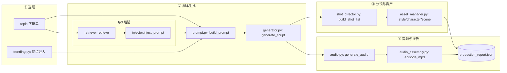
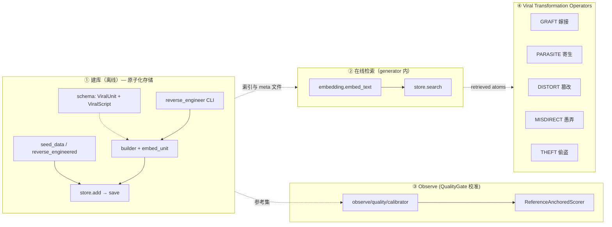

## FlowBeast = Viral Prompt Compiler

**Input: a topic. Output: a complete prompt package ready for AI video tools.**

```
topic → FP3 检索 + 原子组合 → prompt_package.json → Seedance / Kling / 手动使用
```

FlowBeast 的护城河不是生产管线（script → audio → video），而是**爆款内容的可组合 Prompt 结构**。模型和视频工具会越来越强，但"什么 prompt 结构产出的内容容易爆"不会自动出现。FlowBeast 编译的不是代码，而是：情绪 · 冲突 · 镜头 · 节奏 · 爽点 · 人设 · 视觉风格 · 音频情绪。

## Strategic Architecture: What This Project Is Actually About

FlowBeast's competitive advantage is **not** the production pipeline (script → audio → video). That step solves production capacity — a commodity problem with many existing AI tools (Runway, Kling, HeyGen, etc.) that can be integrated via MCP/Skills.

**The real moat is the "Brain"** — the system that decides *what* to produce, not *how* to render it.

### FP3 is a Viral Memory System — Composable Narrative Atoms

FP3 不应只是存储"完整的爆款脚本"。它应该存储**可组合的叙事原子 + 生产原子**：

| 层级 | 叙事原子 | 角色 | 性质 |
|------|----------|------|------|
| 叙事层 | **Hook 原子** | 开场模式（前3秒） | 可插拔 — 独立替换 |
| 叙事层 | **Conflict Kernel** | 核心冲突引擎 | 可迁移 — 跨语义域通用 |
| 叙事层 | **Character Slot** | 角色原型 | 可替换 — 填充不同人设 |
| 叙事层 | **Emotion Track** | 情绪序列 | 可重映射 — 同形状不同情绪 |
| 叙事层 | **Pacing Template** | 节拍节奏 | 可参数化 — 缩放时长密度 |
| 视觉层 | **Style Lock** | 画风锁定（色调/渲染/AR） | 全局锁定 — 防 AI 风格漂移 |
| 视觉层 | **Character Design** | 外观档案（脸/服装/体型） | 跨场景一致 — Seedance 等工具直接读取 |
| 视觉层 | **Scene Composition** | 场景构图（背景/道具/灯光） | 可复用 — 同一场景多角度拍摄 |
| 镜头层 | **Camera Shot** | 镜头语言（景别/角度/运动） | 可组合 — 同叙事换镜头 = 新质感 |
| 音频层 | **Voice Profile** | 音色/语速/情绪强度 | 可映射 — 同文本换音色 = 新氛围 |
| 音频层 | **BGM/SFX 曲线** | 背景音/音效情绪曲线 | 可叠加 — 同画面配不同 BGM = 新调性 |

每个原子独立可嵌入、可检索、可组合。`ViralScript` 不是待检索的文档——而是系统已验证有效的原子配置。

**FP3 是内容生成的 Latent Grammar（隐式语法）：**
- 原子 = 词汇（hook 类型、冲突模式、情绪曲线、视觉风格、镜头语言）
- 合法组合 = 语法（哪些 hook + 哪些 conflict + 哪些 emotion + 哪些 shot = 爆款）
- VTO 算子 = 句法规则（如何把原子变换成新的合法句子）
- QualityGate = 类型检查（拒绝违反隐式语法的组合）

```
逆向工程         FP3 Viral Memory (Latent Grammar)         生成策略层
爆款降维      ┌──────────────────────────────┐      VTO Operators
→叙事原子     │ Narrative Atoms (可插拔)      │      GRAFT / PARASITE
              │ Conflict Kernels (可迁移)     │      DISTORT / MISDIRECT
              │ Emotion Tracks (可重映射)     │      THEFT
              │ Pacing Templates (可参数化)   │
              │                              │
              │ Production Atoms              │      Visual/Audio Layer:
              │ Style Lock (全局锁定)         │      → GRAFT (换画风)
              │ Character Design (外观档案)   │      → DISTORT (换表情)
              │ Scene Composition (场景构图)  │      → PARASITE (热点污染)
              │ Camera Shot (镜头语言)        │      → MISDIRECT (反预期镜头)
              │ Voice Profile (音色档案)      │
              │ BGM/SFX Curve (音频情绪)      │
              │                              │
              │ Latent Grammar (合法组合规则) │
              └──────────────────────────────┘
```

### Viral Transformation Operators (VTO)

| Operator | 公式 | 作用 |
|----------|------|------|
| **GRAFT 嫁接** | `viral_A.hook_atom + topic_B.context` | 保留已验证结构，替换语义域到新话题 |
| **PARASITE 寄生** | `trend_event → inject(narrative_spine)` | 热点事件污染已有叙事骨架，最强流量适配器 |
| **DISTORT 篡改** | `conflict_kernel → exaggerate / invert / compress` | 提升情绪极值，在安全模式内制造非线性冲突 |
| **MISDIRECT 愚弄** | `audience_expectation → violate(key_beat)` | 关键节拍违反预期，驱动评论转发 |
| **THEFT 偷盗** | `viral_arc → re-theme + re-worldbuild` | 偷取他类情绪弧线，换皮到新世界观 |

### Development Priority

1. **Build FP3-S:** 逆向工程把爆款降维为可计算状态数据，正负样本注入
2. **Validate VTO + QualityGate:** 用变换算子生成脚本，基于参考分布评估质量
3. **Integrate MCP for production:** 产能最后解决 — 脚本转视频是已有工程问题


## FlowBeast Architecture

```
┌─────────────────────────────────────┐
│        FlowBeast Core Moat           │
│                                      │
│  逆向工程   FP3 Viral Memory System  │
│  →叙事原子  (Latent Grammar + Atoms) │
│            VTO Operators             │
│            Observe QualityGate       │
└─────────────────────────────────────┘
              ↓
   Production Pipeline (MCP)
   script → audio → video
```

### Drama Pipeline Structure

**flowbeast/drama** 目录下的逻辑流：

> **总览**：一条「选题 → FP3 增强 → LLM 生成 → 脚本 JSON → 导演分镜 → 音频资产 → 生产报告」流水线。



### FP3 子系统（与上图中 `FP3` 框一致）



**drama 与 fp3 的结合点**（唯一）：`flowbeast/drama/generator.py` → `generate_script`：先 `build_prompt(topic)`，再 `FP3Retriever.retrieve(topic)`（内部 **embedding → store.search**），再 `inject_prompt(base_prompt, examples)`，最后 `llm_call`。

`core/config` 的 `settings` 在 pipeline、generator、audio、fp3 的 `store` 路径上提供目录、模型、Key 等。

### 数据飞轮（1→0 逆向拆解引擎）

```
人工筛选市场爆款 → reverse_engineer CLI → ViralScript 拆解为叙事原子
                                                  │
                                        ┌─────────┘
                                        ▼
                    FP3 Viral Memory: 原子化存储 + Latent Grammar 学习
                                        │
                                        ▼
                          QualityGate 校准器（参考集分布对比）
                                        │
                                        ▼
                    VTO 算子 (GRAFT/PARASITE/DISTORT/MISDIRECT/THEFT)
                                        │
                                        ▼
                    脚本生成（原子组合 + VTO 变换 + 热点嫁接）
                                        │
                                        ▼
                    高质量输出 → 回流 FP3（强化有效组合, 惩罚无效）
```

- **阶段A (1→0)：** 人工筛选 → 逆向拆解 → 原子级注入（正负样本）
- **阶段B (0→1)：** 隐式语法校准 → 原子组合质量提升
- **阶段C (自转)：** 生成回流 → 语法精炼 → 更好生成

**核心原则：** 系统不应检索并复制完整脚本。应检索兼容的叙事原子，通过 latent grammar 规则组合，经 VTO 算子变换，生成结构新颖但具备爆款 DNA 的新脚本。

使用 `uv run python -m flowbeast.reverse.reverse_engineer` 将真实漫剧转为 ViralScript 档案。

一流项目:用 pytest + 清晰目录/标记 + pyproject 约定 + CI 分档 + 文档 解决「又全又快」和「脚本 vs 测」的边界；很少靠「一个统一入口文件」。
