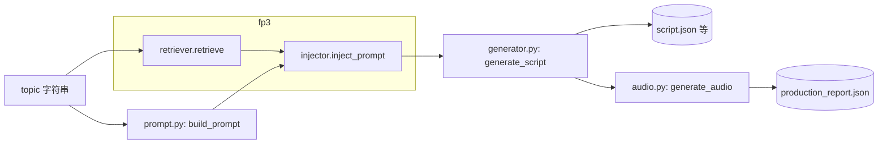
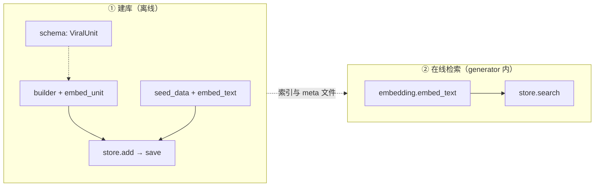

## Text_scripts

### Drama Pipeline Structure

**flowbeast/drama** 目录下的逻辑流：

> **总览**：一条「选题 →（prompt + fp3）→ 剧本 JSON → 落盘 → 配音 → 报告」流水线。`fp3` 只在 **generator** 内参与：在调用 LLM 之前把检索到的基因拼进 prompt。

### FP3 子系统（与上图中 `FP3` 框一致）

**drama 与 fp3 的结合点**（唯一）：`flowbeast/drama/generator.py` → `generate_script`：先 `build_prompt(topic)`，再 `FP3Retriever.retrieve(topic)`（内部 **embedding → store.search**），再 `inject_prompt(base_prompt, examples)`，最后 `llm_call`。

`core/config` 的 `settings` 在 pipeline、generator、audio、fp3 的 `store` 路径上提供目录、模型、Key 等。

一流项目:用 pytest + 清晰目录/标记 + pyproject 约定 + CI 分档 + 文档 解决「又全又快」和「脚本 vs 测」的边界；很少靠「一个统一入口文件」。