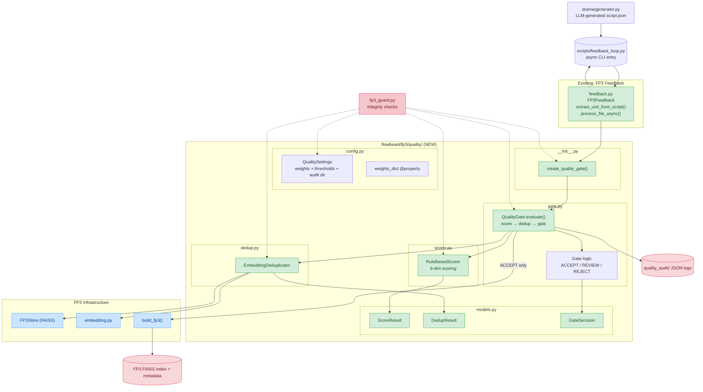

# FP3 QualityGate

FP3 memory governance layer — the **only** gatekeeper allowed to write into FP3 long-term memory.

Pipeline: `candidate → score() → dedup() → gate() → audit → store (if ACCEPT)`

## Architecture



## File Structure

```
flowbeast/fp3/quality/
    __init__.py       # Package exports + create_quality_gate() factory
    config.py         # QualitySettings (9 weights, 2 thresholds, dedup config)
    models.py         # Pydantic: GateAction, ScoreResult, DedupResult, GateDecision
    scorer.py         # BaseScorer (ABC) + RuleBasedScorer (9 heuristic categories)
    dedup.py          # BaseDeduplicator (ABC) + EmbeddingDeduplicator (FAISS-backed)
    gate.py           # QualityGate orchestrator (score → dedup → gate → audit)
    README.md         # This file
```

## FP3 QualityGate 文件关联关系

### 6 个新增文件

```
flowbeast/fp3/quality/
    config.py     ← 配置层（最底层，无依赖）
    models.py     ← 数据模型层（最底层，无依赖）
    scorer.py     ← 评分引擎（依赖 models.py + config.py）
    dedup.py      ← 去重引擎（依赖 models.py + 现有 store.py/embedding.py）
    gate.py       ← 编排器（依赖以上所有 + 现有 builder.py）
    __init__.py   ← 包入口（汇总导出所有类 + 工厂函数）
```

---

### 依赖方向（从上到下）

```
__init__.py
    │
    ├── 导出 config.py    → QualitySettings + quality_settings 单例
    ├── 导出 models.py    → GateAction / ScoreResult / DedupResult / GateDecision
    ├── 导出 scorer.py    → BaseScorer (ABC) + RuleBasedScorer
    ├── 导出 dedup.py     → BaseDeduplicator (ABC) + EmbeddingDeduplicator
    ├── 导出 gate.py      → QualityGate 编排器
    │
    └── create_quality_gate() 工厂函数
         读取 quality_settings
         实例化 RuleBasedScorer + EmbeddingDeduplicator + FP3Store
         组装成 QualityGate 返回
```

---

### 核心文件职责与依赖

**config.py** — 最底层，零依赖

- 定义 `QualitySettings`（pydantic BaseSettings）
- 9 个评分权重、2 个阈值、去重阈值、审计目录
- 通过 `QUALITY_` 环境变量覆盖
- 提供 `quality_settings` 全局单例和 `weights_dict` 属性

**models.py** — 最底层，零依赖

- 定义 4 个 Pydantic 模型：`GateAction`（枚举）、`ScoreResult`（评分结果）、`DedupResult`（去重结果）、`GateDecision`（最终决策）
- 被 scorer、dedup、gate 三个文件共同使用

**scorer.py** — 依赖 `models.py` + `config.py`

- `BaseScorer` 是抽象基类，定义 `async score(unit) → ScoreResult` 接口
- `RuleBasedScorer` 是具体实现，包含 9 个 `_score_*()` 私有方法（hook_strength、emotional_intensity、novelty 等），每个返回 `(分数, 解释)`
- 加权总分 = Σ(分类得分 × 权重)，权重来自 `config.py` 的 `weights_dict`

**dedup.py** — 依赖 `models.py` + 现有 `store.py` / `embedding.py`

- `BaseDeduplicator` 是抽象基类，定义 `async check_duplicate(unit, store) → DedupResult` 接口
- `EmbeddingDeduplicator` 是具体实现：对候选 ViralUnit 调用 `embed_unit()` 得到向量，调用 `store.search_with_scores()` 找到最近邻，通过 `_l2_to_cosine()` 将 FAISS L2 距离转为余弦相似度，超过阈值则判定为重复
- 为未来接入 Qdrant/Weaviate/pgvector 预留了接口

**gate.py** — 核心编排器，依赖以上所有 + 现有 `builder.py`

- `QualityGate` 组合了 scorer + deduplicator + store
- `evaluate(unit)` 方法按顺序执行：评分 → 去重 → 规则判定（_apply_gate_rules）→ 写审计日志
- 决策逻辑：重复 → REJECT；分数 ≥ 0.60 → ACCEPT；0.40~0.60 → REVIEW；< 0.40 → REJECT
- `store_unit(unit)` 仅在 ACCEPT 时调用现有 `build_fp3()` 写入 FP3 索引
- 每次评估都在 `data/quality_audit/` 下写一个 JSON 审计文件

****init**.py** — 包入口

- 统一导出所有公开类
- 提供 `create_quality_gate()` 工厂函数，读取 `quality_settings` 后自动组装 scorer/dedup/store，返回一个开箱即用的 `QualityGate` 实例

---

### 与现有文件的改动关系

| 现有文件                       | 改动                                     | 原因                                        |
| -------------------------- | -------------------------------------- | ----------------------------------------- |
| `store.py`                 | 新增 `search_with_scores()` 方法           | 去重需要返回距离值，原 `search()` 只返回元数据             |
| `feedback.py`              | 新增 `process_file_async()` 方法           | 替换直接 `build_fp3()`，改为经 QualityGate 评估后再存储 |
| `scripts/feedback_loop.py` | 切换为调用 `process_file_async()`           | CLI 入口走 QualityGate 流水线                   |
| `hooks/fp3_guard.py`       | `required_files` 增加 quality 目录下的 5 个文件 | git hook 检查 quality 模块完整性                 |


## Usage

```python
from flowbeast.fp3.quality import create_quality_gate, GateAction
from flowbeast.fp3.schema import ViralUnit

gate = create_quality_gate()
unit = ViralUnit(
    hook="她被开除后，前东家求她回去救命",
    pattern="身份反转",
    emotion=["satisfaction", "shock"],
)
decision = await gate.evaluate_and_store(unit)
print(decision.action)  # GateAction.ACCEPT | GateAction.REJECT | GateAction.REVIEW
print(decision.reason)  # "Score 0.7234 >= 0.60"
```

## Configuration (Environment Variables)

| Variable | Default | Description |
|----------|---------|-------------|
| `QUALITY_GATE_ENABLED` | `true` | Master toggle |
| `QUALITY_ACCEPT_THRESHOLD` | `0.60` | Score to auto-accept |
| `QUALITY_REVIEW_THRESHOLD` | `0.40` | Score floor (below = reject) |
| `QUALITY_WEIGHT_HOOK_STRENGTH` | `0.20` | Hook dimension weight |
| `QUALITY_WEIGHT_EMOTIONAL_INTENSITY` | `0.15` | Emotion dimension weight |
| `QUALITY_WEIGHT_NOVELTY` | `0.10` | Novelty dimension weight |
| `QUALITY_WEIGHT_RETENTION_POTENTIAL` | `0.15` | Retention dimension weight |
| `QUALITY_WEIGHT_VIRALITY_SIGNALS` | `0.10` | Virality dimension weight |
| `QUALITY_WEIGHT_PACING` | `0.08` | Pacing dimension weight |
| `QUALITY_WEIGHT_ENGAGEMENT_DENSITY` | `0.08` | Engagement dimension weight |
| `QUALITY_WEIGHT_CONFLICT_DENSITY` | `0.08` | Conflict dimension weight |
| `QUALITY_WEIGHT_REPLAY_POTENTIAL` | `0.06` | Replay dimension weight |
| `QUALITY_DEDUP_SIMILARITY_THRESHOLD` | `0.85` | Cosine similarity dedup threshold |
| `QUALITY_DEDUP_SEARCH_K` | `5` | Nearest neighbors to check |
| `QUALITY_QUALITY_AUDIT_DIR` | `flowbeast/data/quality_audit` | Audit log directory |

## Decision Logic

```
duplicate detected? ──────YES──────→ REJECT (regardless of score)
          │
          NO
          ↓
score >= 0.60? ────────YES──────→ ACCEPT → store_unit() → FP3
          │
          NO
          ↓
score >= 0.40? ────────YES──────→ REVIEW (log warning, not stored)
          │
          NO
          ↓
                              → REJECT (log reason, not stored)
```
