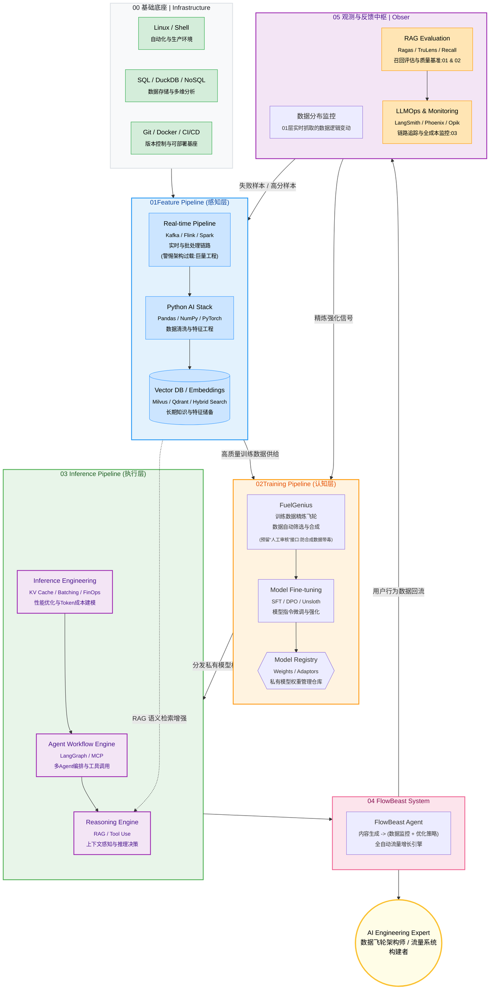

# FlowBeast-Agent  
>**The Data Workflow Compiler for LLMops**

---

## Overview
**FlowBeast Agent** is an intelligent agent that automates and optimizes data workflows — from raw data ingestion to transformation and deployment — acting like a **compiler** for data engineering tasks.It converts high-level workflow descriptions into executable, efficient pipelines.



---

## Core Features
- **Workflow Compiler** — Translates data flow definitions into optimized DAGs (Directed Acyclic Graphs).  
- **AI-assisted Optimization** — Uses AI heuristics to suggest pipeline improvements.  
- **Multi-backend Support** — Integrates with Spark, Airflow, and DVC pipelines.  
- **Reproducible Builds** — Every data transformation is versioned and trackable.  
- **Declarative DSL** — Describe what you want, not how to run it.

## Tech stack

* **Core Languages:** Python, LLMOps
* **Agent Frameworks:** LangChain / LlamaIndex
* **Backend Services:** FastAPI, Uvicorn
* **Deployment/Containerization:** Docker
* **Frontend Interaction:** VS Code Extension API
* **Target Ecosystem:** dbt-core, Apache Airflow / Dagster

---

## Project Structure
```bash
.
├── create_project_structure.py
├── FlowBeast
│   ├── deployments
│   │   ├── docker
│   │   ├── k8s
│   │   └── terraform
│   ├── Dockerfile
│   ├── docs
│   │   ├── DEVELOPMENT.md
│   │   └── README.md
│   ├── flowbeast
│   │   ├── agent
│   │   ├── api
│   │   ├── codegen
│   │   ├── commercial
│   │   ├── compiler
│   │   ├── data
│   │   ├── execution
│   │   ├── __init__.py
│   │   ├── ir
│   │   └── __pycache__
│   ├── generated_workflow.py
│   ├── __init__.py
│   ├── main.py
│   ├── market_material
│   │   ├── case_studies
│   │   ├── docs
│   │   └── pricing
│   ├── pyproject.toml
│   ├── README.md
│   ├── requirements.txt
│   ├── run.py
│   ├── start_dev.sh
│   ├── start_production.sh
│   ├── test_data
│   │   └── input.csv
│   ├── tests
│   │   ├── conftest.py
│   │   ├── __init__.py
│   │   ├── test_codegen.py
│   │   └── test_compiler.py
│   ├── ultimate_verify.py
│   ├── uv.lock
│   ├── verify_cody.py
│   ├── verify.py
│   └── vs_code_extension
│       ├── media
│       ├── package.json
│       ├── src
│       ├── test
│       └── tsconfig.json
├── logs
│   ├── dev
│   └── prod
│       ├── flowdeastr_v2-bash_history_2025-11-08_1819.log
│       ├── flowdeast_v2-bash_history_2025-11-08_0958.log
│       └── flowdeast_v2-bash_history_2025-11-25_1501.log
└── start.sh

30 directories, 29 files
````

## Quick Start (To Be Completed)

1. **Environment:** Clone the repository and create a Python virtual environment.
2. **API Key:** Configure LLM API Key in the `.env` file.
3. **Run Backend:** `docker-compose up` (to be implemented) or `uvicorn src.main:app --reload`
4. **Install Extension:** Build `vsc_extension` and install it into local VS Code.
5. **Enjoy!** (to be implemented)

---

## Installation

```bash
git clone https://github.com/ArlesZhang/FlowBeast.git
cd FlowBeast-p1/FlowBeast
pip install -r requirements.txt
```

---

## ▶️ Run Example

```bash
python src/main.py --config examples/sample_workflow.yaml
```

---

## Roadmap

* [ ] Define DSL for workflow description
* [ ] Implement core compiler engine
* [ ] Integrate AI optimization agent
* [ ] Add Airflow backend
* [ ] Release v0.1.0

---

## Author

**Arles Zhang**

> Building AI-powered compiler systems for data engineers.
> GitHub: [@arleszhang](https://github.com/arleszhang)

---

### **requirements.txt**

```txt
# Core dependencies By GPT5 
fastapi==0.115.0
uvicorn==0.30.0

# Data workflow & orchestration
pandas==2.2.3
pydantic==2.9.0
networkx==3.3

# ML & optimization
scikit-learn==1.5.2

# Version control & reproducibility
dvc==3.50.0

# Testing & linting
pytest==8.3.3
black==24.10.0
````

```txt
# DataCody Agent Backend Dependencies By Gemini

# Web Framework and Server
fastapi==0.110.0
uvicorn[standard]==0.27.1

# LLM & Agent Framework
langchain==0.1.13  # 或者 llama-index，选择其一
pydantic==2.6.4    # 用于结构化输出 (JSON Schema)

# LLM Provider (假设使用 OpenAI)
openai==1.14.3
# 如果使用其他模型，例如 Claude:
# anthropic==0.23.1

# Data Engineering Tooling (用于解析 dbt 相关文件)
pyyaml==6.0.1
dbt-core==1.7.0  # 用于理解 dbt 的依赖结构和解析器

# 环境和调试
python-dotenv==1.0.1

# ------------------------------
# 可选依赖 (后续迭代时加入)
# ------------------------------
# 数据库/向量库 (用于 RAG 记忆)
# chromadb==0.4.24
# duckdb==0.10.1

# 分布式计算 (Spark集成)
# pyspark==3.5.0

# 文件操作/AST解析
# typed-ast==1.5.5

