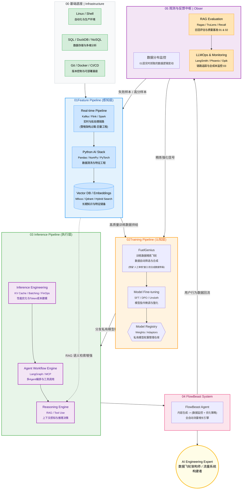

# FlowBeast-Agent  
>**The Data Workflow Compiler for LLMops**

---

## Overview
**FlowBeast Agent** is an intelligent agent that automates and optimizes data workflows — from raw data ingestion to transformation and deployment — acting like a **compiler** for data engineering tasks.It converts high-level workflow descriptions into executable, efficient pipelines.



---

## Core Features
- **Workflow Compiler** — Translates data flow definitions into optimized DAGs (Directed Acyclic Graphs).  
- **AI-assisted Optimization** — Uses AI heuristics to suggest pipeline improvements.  
- **Multi-backend Support** — Integrates with Spark, Airflow, and DVC pipelines.  
- **Reproducible Builds** — Every data transformation is versioned and trackable.  
- **Declarative DSL** — Describe what you want, not how to run it.

## Tech stack

* **Core Languages:** Python, LLMOps
* **Agent Frameworks:** LangChain / LlamaIndex
* **Backend Services:** FastAPI, Uvicorn
* **Deployment/Containerization:** Docker
* **Frontend Interaction:** VS Code Extension API
* **Target Ecosystem:** dbt-core, Apache Airflow / Dagster


| 优先级   | 技术栈/能力（融合Gemini工具）                                     | 权重  | 项目相关度                      | 必须掌握到什么程度                                                                                                                                                       | 推荐工具（Gemini+我的）                                                                                                     | 备注（商业价值，融合理由）                           |
| ----- | ------------------------------------------------------ | --- | -------------------------- | --------------------------------------------------------------------------------------------------------------------------------------------------------------- | ------------------------------------------------------------------------------------------------------------------- | --------------------------------------- |
| 1     | Python深度                                               | 95  | 极高                         | 能不看任何AI独立手写 compiler/parser/codegen 80%代码<br>30分钟手撕高频10大数据结构                                                                                                    | Pandas/NumPy/FastAPI + Ruff/Pydantic                                                                                | Gemini核心+我的基石；大厂敲门砖。                    |
| 2     | LLM全栈（Prompt/RAG/Agent/微调）<br>[[数据飞轮+智能引擎-必读书籍推荐]]     | 93  | 极高                         | 1.能独立搭建完整RAG链<br>能用LangGraph写多Agent协作.   2.能本地跑Phi-3/Llama-3.1-8B LLM全栈，包括LangGraph/AutoGen<br>(不是从零造模型，而是拿现成模型（像Llama-3.1、Phi-3）当“聪明助手”，通过提示/检索/代理/微调，让它帮你干活。) | HF Transformers + LangChain/LangGraph/LangSmith + NLPAug                                                            | Gemini HF/RAG + 我的LangGraph；2025卖点。     |
| 3     | [[向量数据库]] <br>&<br>Cloud Technologies: AWS, GCP, Azure | 90  | 极高                         | 能独立完成：向量入库 → 混合检索（向量+元数据过滤）→ 自动重排<br>项目里所有“找历史”“相似样本”全走向量库                                                                                                      | Qdrant/Milvus/Chroma                                                                                                | 我的核心，补Gemini缺失；语义搜索刚需。                  |
| 4     | LLMOps & 数据可观测性                                        | 87  | 高                          | 能实时看到：Prompt成功率、检索召回率、生成质量分数、成本曲线<br>出问题10分钟内定位                                                                                                                 | LangSmith/Phoenix/Grafana + Matplotlib/Seaborn（Gemini可视化）                                                           | 我的趋势 + Gemini质量评估；大厂面试加分。               |
| 5     | 实时数据链路（Kafka+Flink流处理）                                 | 82  | 高                          | Kafka能稳定扛1w条/秒消息<br>能用Flink或Spark Structured Streaming消费后写向量库                                                                                                   | Kafka/Redpanda + Redis/RabbitMQ（Gemini队列） + Spark Streaming                                                         | 我的实时 + Gemini消息队列；飞轮闭环关键。               |
| 6     | DS&A（Python版）                                          | 80  | 高                          | 闭眼手撕：LRU、LFU、Trie、单调栈、拓扑排序、并查集<br>能现场分析项目代码复杂度                                                                                                                  | LeetCode + AST/Tree-sitter（Gemini代码理解）                                                                              | 我的DS&A + Gemini AST；面试/优化分水岭。           |
| 7     | 生产部署与工程化（Docker+CI/CD+监控）                              | 78  | 高                          | Docker一键启动 → GitHub Actions自动构建镜像 → 部署到云 → Grafana大盘实时展示                                                                                                        | Docker Compose/GitHub Actions + Streamlit/Gradio（GeminiUI）                                                          | 我的部署 + Gemini CI/CD/Streamlit；商业Demo必需。 |
| 8     | 数据工程基础（SQL+Spark批处理+编排）                                | 70  | 中高                         | 能独立写复杂SQL窗口函数<br>能用Spark处理百GB parquet<br>用Dagster把所有任务编排成DAG                                                                                                    | DuckDB/Spark + Prefect/Dagster（Gemini调度） + PostgreSQL/S3                                                            | Gemini Spark/SQL + 我的Dagster；企业级扩展。     |
| 9     | **系统与可观测性**  <br>(Shell+日志+指标)                         | 70  | 中  <br>• 自动化脚本  <br>• 系统监控 | **边用边学**：  <br>1. 替换项目中的手动操作为脚本  <br>2. 添加日志系统  <br>3. 建立健康检查                                                                                                   | • **Shell学习**：[LinuxCommand.org](https://linuxcommand.org/)  <br>• **日志**：structlog  <br>• **指标**：Prometheus Client |                                         |
| 10    | 隐私与合规（差分隐私/合成数据）                                       | 65  | 中                          | FuelGenius生成的训练数据能通过隐私检测<br>对外宣称“零原始数据泄露”                                                                                                                       | Opacus/TensorFlow Privacy/SDV + OAuth/数据脱敏（Gemini安全）                                                                | 我的差分 + Gemini OAuth；2026企业客户前提。         |
| other | 性能优化-<br>[[C++ & Rust热点]]                              | 40  | 低                          | 只在QPS>10w或单条延迟<3ms时才动手<br>会用pybind11/Rust把热点函数提速30倍                                                                                                             | pybind11/Rust + PyO3 + Java/Scala（Gemini后期）                                                                         | 我的优化 + Gemini Java；卡性能时补。               |


**将技术栈串联起来的端到端流程**：从数据产生到生成高正确率数据/代码

| 阶段                                          | 技术栈起点/主要使用                                                                                  | 负责工作（例子）                                                                                                                       | 输入/输出                                     | 为什么在这里（与前后串联）                                                                    | 结束点/过渡                                      |
| ------------------------------------------- | ------------------------------------------------------------------------------------------- | ------------------------------------------------------------------------------------------------------------------------------ | ----------------------------------------- | -------------------------------------------------------------------------------- | ------------------------------------------- |
| **1. 数据产生/采集**<br>（起点：原始数据源头）               | Python深度（基础脚本采集） + 数据工程基础（SQL初步查询） + 实时数据链路（Kafka摄入）                                        | 采集业务数据（e.g., 电商订单日志） + 用户行为埋点（e.g., 点击/浏览事件）。用Kafka实时捕获，或SQL/Spark从数据库拉取批数据。                                                   | 输入：实时事件/数据库记录。<br>输出：原始数据集（JSON/CSV/日志）。  | 这是起点，一切从数据生开始。Python/DS&A确保高效采集（e.g., 用Trie存储埋点ID）。实时链路（Kafka）处理高吞吐，避免丢失。        | 过渡到处理：原始数据太脏/乱，直接喂给下游会崩。用批/流处理初步结构化。        |
| **2. 实时/批处理摄入 & 初步转换**                      | 实时数据链路（Kafka+Flink） + 数据工程基础（SQL+Spark批处理+编排如Dagster） + DS&A（优化算法）                          | 流处理：Kafka扛1w条/秒，用Flink实时过滤/聚合（e.g., 合并用户行为事件）。<br>批处理：Spark处理百GB数据，用SQL窗口函数计算指标（e.g., 日活跃用户）。初步转换（e.g., 格式统一）。                 | 输入：原始日志。<br>输出：结构化数据（Parquet/表）。          | 串联采集后：数据产生后立即处理，避免积压。Flink/Spark嵌入初步清洗逻辑（e.g., 去重用并查集）。Dagster编排成DAG，确保顺序。       | 过渡到清洗：处理后数据更规范，但仍需深度清洗。向量入库准备在这里开始（如果需要嵌入）。 |
| **3. 数据清洗/增强**                              | Python深度（Pandas/NumPy核心清洗） + DS&A（高效实现如单调栈排序脏数据） + LLM全栈（Prompt/RAG/Agent/微调辅助）             | Python清洗：用Pandas去空值/异常，NumPy计算统计。<br>LLM增强：用Agent生成合成数据（e.g., Prompt让Llama-3.1填充缺失值），RAG检索历史相似样本增强多样性。微调模型专用于清洗（e.g., 领域特定验证）。 | 输入：结构化数据。<br>输出：清洁/增强数据集（高正确率）。           | 串联处理后：清洗嵌入批/流中，但这里深度化。LLM全栈是关键“智能升级”——手动清洗太慢，用Agent自动化（e.g., 在FuelGenius生成燃料数据）。 | 过渡到存储：清洗后数据可靠，才入库。否则脏数据污染下游。                |
| **4. 存储/入库 & 检索准备**                         | 向量数据库 & Cloud（Qdrant/Milvus/Chroma入库 + AWS S3/GCP存储） + 数据工程基础（PostgreSQL持久化）                | 向量入库：清洗后嵌入成向量（e.g., 用HF Transformers生成嵌入），支持混合检索（向量+元数据过滤）。云存储：S3存大文件。                                                         | 输入：清洁数据。<br>输出：可查询库（向量/关系表）。              | 串联清洗后：向量入库在这里（非起点），因为需清洁数据。云科技确保规模化（e.g., GCP处理TB级）。为下游RAG/Agent提供“知识库”。         | 过渡到自动化：入库后，数据可被Agent检索/使用，生成代码。             |
| **5. 数据管道自动化 & 代码生成**<br>（核心AI层：生成高可用数据/代码） | LLM全栈（Prompt/RAG/Agent/微调主驱） + Python深度（FastAPI生成API） + 生产部署（Docker打包管道） + DS&A（优化生成的代码复杂度） | 用Cody Agent：理解需求（Prompt解析），RAG检索历史管道，Agent协作生成代码（e.g., LangGraph多代理吐出Spark清洗脚本）。微调确保高正确率（e.g., 专调模型生成无bug代码）。                  | 输入：用户需求/库中数据。<br>输出：自动生成的管道代码/增强数据（高可用性）。 | 串联存储后：用LLM全栈“编译”整个链（e.g., 在Cody Agent生成FuelGenius的清洗管道）。这是你的项目核心，AI自动化取代手动。      | 过渡到部署：生成的代码需上线运行。                           |
| **6. 生产部署 & 运行**                            | 生产部署与工程化（Docker+CI/CD+监控） + Cloud（AWS/GCP/Azure部署） + 数据工程基础（Dagster编排运行）                    | Docker一键启动生成的管道，GitHub Actions自动构建/部署到云。Grafana监控运行。                                                                           | 输入：生成的代码。<br>输出：运行中的管道（产出最终数据/结果）。        | 串联生成后：代码生成后需部署成生产级（e.g., 容器化确保可扩展）。云科技提供Infra。                                   | 过渡到观测：部署后全程监控，确保高正确率。                       |
| **7. 监控/观测 & 迭代**<br>（结束：但循环反馈）             | LLMOps & 数据可观测性（LangSmith/Phoenix/Grafana全程追踪） + Python深度（Matplotlib可视化曲线）                  | 实时观测：Prompt成功率、检索召回率、成本曲线（e.g., Grafana大盘）。出问题10min定位，反馈回上游迭代（e.g., 低质量 → 重调Agent）。                                            | 输入：全链日志/指标。<br>输出：优化建议/警报（确保高可用性）。        | 串联全程（非只结束）：从产生开始监控（e.g., Kafka摄入率），到结束可视化质量。像“闭环反馈”，防低正确率。                       | 结束点：生成高可用数据/代码后，观测确认OK。但循环：问题 → 回溯清洗/生成。    |

**总结** 
- **整体串联逻辑**：起点（产生）→ 处理/清洗（批/流 + Python + LLM增强）→ 存储（向量/云）→ 自动化生成（LLM全栈核心）→ 部署（生产化）→ 观测（LLMOps全程）。你的理解线性对，但需调整为“嵌入式 + 循环”（LLM全栈/LLMOps不是后置）。
- **高正确率/可用性保障**：靠LLM全栈的微调/Agent（生成可靠输出） + LLMOps的实时评分/定位。
- **你的项目锚点**：FuelGenius覆盖阶段1-4（燃料产生/清洗/增强），Cody Agent覆盖5-7（编译生成/部署/观测）。
- **MVP**：建个小POC（Proof of Concept）：用Kafka模拟数据产生 → Spark清洗 → RAG增强 → LangSmith观测。

---

## Project Structure
```bash
datacody-agent/
├── src/                          # Core backend code for the Agent
│   ├── compiler/                 # Core compilation logic (Workflow Compiler Engine)
│   ├── dsl/                      # Domain-Specific Language / IR (e.g., abstract dbt Tasks)
│   ├── agents/                   # AI reasoning and optimization modules (RAG retrieval, LLM tool calling logic)
│   ├── tools/                    # MCP tool orchestration (e.g., dbt-core parser, Great Expectations integration)
│   └── main.py                   # Entry point for the FastAPI application
├── vsc_extension/                # VS Code extension frontend (TypeScript/JavaScript) - key MVP deliverable
├── tests/                        # Unit and integration tests
├── configs/                      # Configuration files (.env, LLM parameters, YAML templates, etc.) - key for engineering practice
├── data/                         # Example dbt projects or test data
└── requirements.txt
└── README.md
````

## Quick Start (To Be Completed)

1. **Environment:** Clone the repository and create a Python virtual environment.
2. **API Key:** Configure LLM API Key in the `.env` file.
3. **Run Backend:** `docker-compose up` (to be implemented) or `uvicorn src.main:app --reload`
4. **Install Extension:** Build `vsc_extension` and install it into local VS Code.
5. **Enjoy!** (to be implemented)

---

## Installation

```bash
git clone https://github.com/ArlesZhang/DataCody-Agent.git
cd DataCody-Agent
pip install -r requirements.txt
```

---

## ▶️ Run Example

```bash
python src/main.py --config examples/sample_workflow.yaml
```

---

## Roadmap

* [ ] Define DSL for workflow description
* [ ] Implement core compiler engine
* [ ] Integrate AI optimization agent
* [ ] Add Airflow backend
* [ ] Release v0.1.0

---

## Author

**Arles Zhang**

> Building AI-powered compiler systems for data engineers.
> GitHub: [@arleszhang](https://github.com/arleszhang)

---

### **requirements.txt**

```txt
# Core dependencies By GPT5 
fastapi==0.115.0
uvicorn==0.30.0

# Data workflow & orchestration
pandas==2.2.3
pydantic==2.9.0
networkx==3.3

# ML & optimization
scikit-learn==1.5.2

# Version control & reproducibility
dvc==3.50.0

# Testing & linting
pytest==8.3.3
black==24.10.0
````

```txt
# DataCody Agent Backend Dependencies By Gemini

# Web Framework and Server
fastapi==0.110.0
uvicorn[standard]==0.27.1

# LLM & Agent Framework
langchain==0.1.13  # 或者 llama-index，选择其一
pydantic==2.6.4    # 用于结构化输出 (JSON Schema)

# LLM Provider (假设使用 OpenAI)
openai==1.14.3
# 如果使用其他模型，例如 Claude:
# anthropic==0.23.1

# Data Engineering Tooling (用于解析 dbt 相关文件)
pyyaml==6.0.1
dbt-core==1.7.0  # 用于理解 dbt 的依赖结构和解析器

# 环境和调试
python-dotenv==1.0.1

# ------------------------------
# 可选依赖 (后续迭代时加入)
# ------------------------------
# 数据库/向量库 (用于 RAG 记忆)
# chromadb==0.4.24
# duckdb==0.10.1

# 分布式计算 (Spark集成)
# pyspark==3.5.0

# 文件操作/AST解析
# typed-ast==1.5.5

